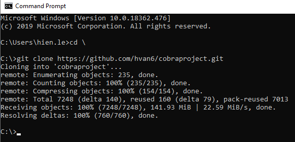
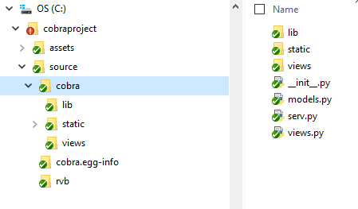

# Get COBRA working locally
The following steps will let you get COBRA installed and running locally

**Requirement**:
* Windows OS (10 or server 2016)
* Python >=3.7.5
* Internet


## Clone COBRA GitHub repository
**Recommend** clone COBRA to `C:\cobraproject`.

$ `git clone https://github.com/hvan6/cobraproject.git`  

  

Make sure COBRA project has the following folder structure.  

  


## COBRA env directory path setting
* If you clone `cobraproject` to another directory different with `C:\cobraproject`, **UPDATE** `VENV` path to the correct path to the directory of your local COBRA in following files:
  ```
  C:\cobraproject\source\firstRun.bat
  C:\cobraproject\source\run.bat
  ```

* Make sure `set VENV=C:\cobraproject\env` is at the first line in following files:
  ```
  C:\cobraproject\source\firstRun.bat
  C:\cobraproject\source\run.bat
  ```
  

## Unzip dataset
We are NOT allowed to push files larger than `100 MB` to GitHub due to [conditions for large files](https://help.github.com/en/github/managing-large-files/conditions-for-large-files), so you need to unzip dataset file manually before compiling COBRA project.

Unzip dataset zip file from:

  `C:\cobraproject\source\cobra\static\properties_2017_cleaned10-30.zip`
  
to:

  `C:\cobraproject\source\cobra\static\properties_2017_cleaned10-30.csv`


## Start the COBRA server

* If it is the first time execution, double click on `firstRun.bat` to install environment packages and compile project, do **NOT** close command prompt window

* Otherwise, double click on `run.bat` to compile project, do **NOT** close command prompt window

* Open a browser and navigate to: http://localhost:6543/


## Trouble shooting
If you have any question to compile COBRA project, please contact us for help:
* [Hien Le](https://leohien.net/): hvan6@gatech.edu
* [Stephen Wang](http://stephenwang.me/): Stephen.Wang@gatech.edu
